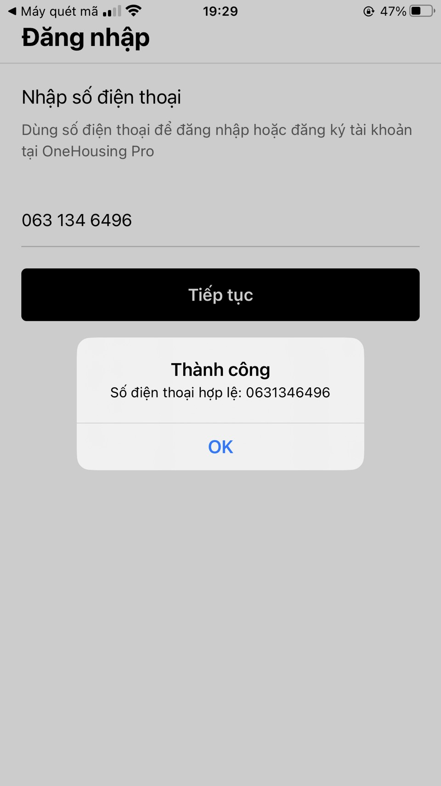
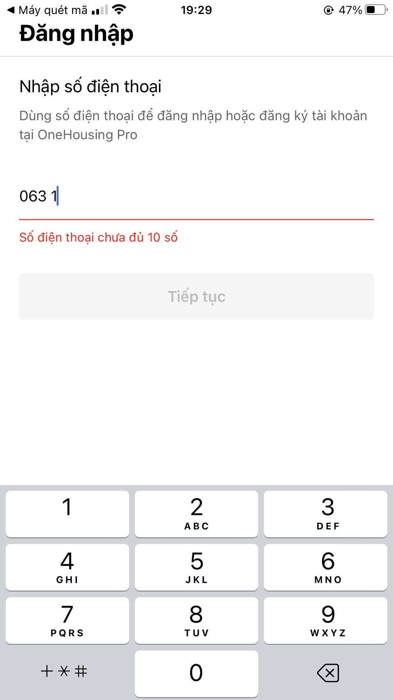

# BÀI TẬP 6.1 – SIGN IN VALIDATION

## Thông tin sinh viên
- Họ và tên: [Lê Đình Hoàng]
- Mã sinh viên: [23810310289]
- Môn học: Lập trình Mobile cơ bản

---

## Tiêu đề bài tập
Xây dựng màn hình Đăng nhập (Sign In) có kiểm tra dữ liệu nhập vào.

---

## Hình ảnh kết quả

### Màn hình 1

### Màn hình 2

---